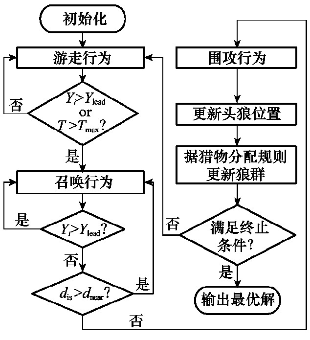

# Multi-unmanned-platform-collaborative-tracking-decision-making-and-path-planning
# 多无人平台协同跟踪决策与路径规划

## 选题的背景与意义 Background and Significance of Topic Selection

- ### 无人作战平台

无人机是俄乌冲突中备受关注的武器之一，尤其是进入堑壕战之后，双方消费级无人机和自杀式无人机在战场内外的表现非常活跃，更是成为外界热议的话题。为了有效地控制敌人和保护自己，攻城掠地的意义已经不大。如何减少人员战斗接触和伤亡，以非人员接触方式进行攻击，迫使敌人降服才至关重要。

- ### 陆基无人平台

无人战车作战具有无人员伤亡、突袭性强、火力强大、机动速度快、作战效益高、战场部署快等诸多优点，可能实现以零伤亡的代价完成作战使命。

## 研究内容 Research Contents

- ### 在随机生成的战场环境下判断战斗势态，计算各目标的攻击成本以匹配适应度函数 Determine the battle situation in a randomly generated battlefield environment, and calculate the attack cost of each target to match the fitness function

- ### 借以适应度函数，利用狼群算法迭代计算得出最优策略 Based on the fitness function, the optimal strategy is iteratively calculated by using the wolf pack algorithm

狼群算法
Wolf Pack Algorithm，WPA
以群体智能为基础的优化算法。设计一种基于狼群算法的多无人平台协同跟踪决策系统，以满足复杂战斗环境下的战略战术需求。根据相关战斗理论建立成本评估体系与对应的适应度函数，以此将狼群算法与实际问题相结合，进而利用狼群算法迭代计算得出最优策略。

- ### 使用A星算法进行路径规划，保证各无人平台能够按计划接近目标 The A-star algorithm is used for path planning to ensure that each unmanned platform can approach the target as planned

是在已知的全局高精地图上，根据已知起点和目标点，规划出一条全局最优路径。A*算法是一种静态路网中求解最短路径最有效的直接搜索方法，对路径上每个节点进行检索时，它都会引入全局信息，对车辆路径点和目标点之间的距离进行估计。这是一种启发式搜索算法，具有计算方式简单、搜索速度快、环境适应力强以及规划的路径较短等优点。

- ### 最终利用仿真环境检验整体算法流程的可行性与鲁棒性 Finally, the simulation environment is used to test the feasibility and robustness of the overall algorithm process

## 关于 About

- 如有建议、疑惑等，大家可以发邮件至 [作者邮箱](mailto:looooading@outlook.com) 交流探讨。If you have any suggestions, doubts, etc., you can send an email to the [author's email address](mailto:looooading@outlook.com) to discuss.
